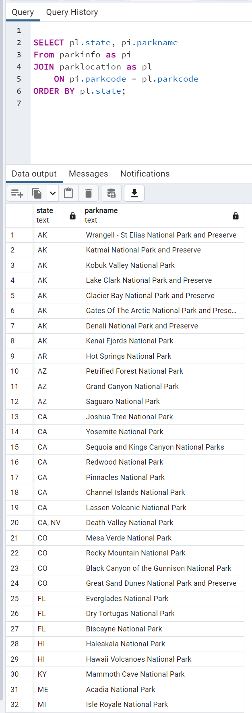
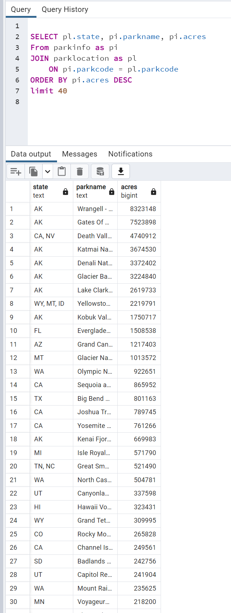
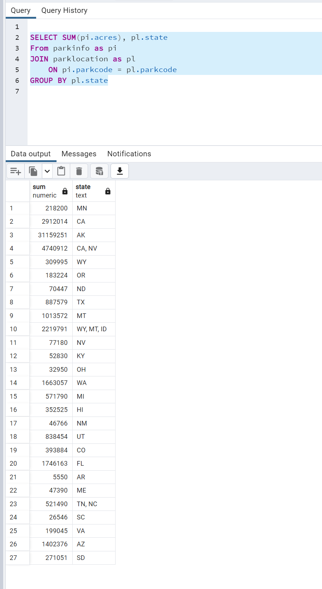

# ETL Project

Extract-Transform-Load project that pulls National Park data from a CSV using Python Pandas and loads the data into Postgres (SQL Server) using Psycopg2 and SQLalchemy modules

Queries screenshots>

Query 1: Group the national parks by state.

Query 2: What are the largest national parks?

Query 3: What are the total acres per state for all national parks?

 